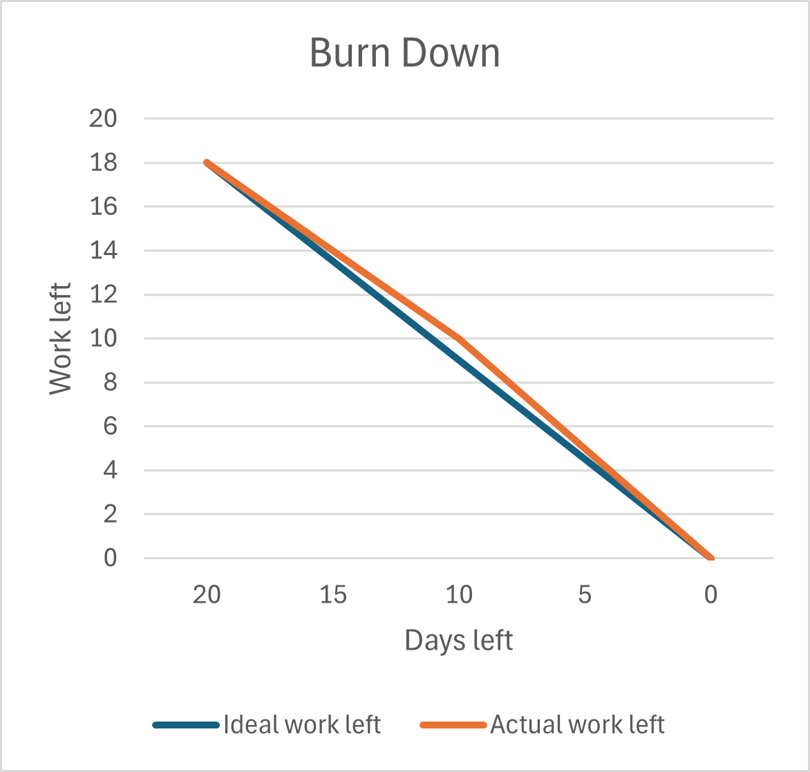

# iteration-1

* Assumed Velocity: 0.7
* Number of developers: 4
* Total estimated amount of work: 18 (initial: 11) days

## User stories or tasks:
### Todo
1. Secure Storage, priority Low, 3 (initial: 3) days  
   - Create database schema with sample records, 1 day
   - Integrate database with Flask using Flask-SQLAlchemy, 2 day
2. Secure Online Registration, priority High, 6 (initial: 2) days  
   - Analyse form considerations (user roles, validation, compliance), 1 day
   - Backend registration logic (hashing, storage, CSRF protection), 2 days 
   - Backend registration logic (email), 1 day
   - Frontend form validation + accessibility, 1 day 
   - Testing for registration flow, 1 day 
3. Membership Payment Handling, priority Low, 4 (initial: 3) days
   - Backend online payment integration (mock transaction logic, success/failure states, storage), 1 day
   - Backend offline payment integration (storage), 0.5 day
   - Frontend form modification for online and offline payment (Includes alert to pay at counter for offline payment), 0.5 day
   - Backend membership activation logic (storage, status), 0.5 day
   - Frontend membership confirmation (status), 0.5 day
   - Testing for membership handling flow, 1 day
4. Session Booking, priority High, 5 (initial: 3) days
   - Backend booking logic (slot availability, booking action + status, storage), 1 day
   - Frontend display (calendar, slot availability, booking action + status), 1 day
   - Backend booking logic (confirmation email (DRY), reminder emails), 1 day
   - Integrated user authentication for session booking,1 day
   - Testing for booking flow, 1 day

### In progress:

### Completed:
* Secure Storage
   - Create database schema with sample records (TQRN), 20 June 2025
   - Integrate database with Flask using Flask-SQLAlchemy (HX, YJ), 21 June 2025
* Secure Online Registration  
   - Analyse form considerations (user roles, validation, compliance) (MTN), 22 June 2025
   - Backend registration logic (hashing, storage, CSRF protection) (YJ), 24 June 2025
   - Backend registration logic (email) (HX), 26 June 2025
   - Frontend form validation + accessibility (TQRN), 27 June 2025
   - Testing for registration flow (All), 5 July 2025
* Membership Payment Handling
   - Backend online payment integration (mock transaction logic, success/failure states, storage) (YJ), 1 July 2025
   - Backend offline payment integration (storage) (HX), 1 July 2025
   - Frontend form modification for online and offline payment (Includes alert to pay at counter for offline payment) (MTN), 1 July 2025
   - Backend membership activation logic (storage, status) (HX), 2 July 2025
   - Frontend membership confirmation (status) (TQRN), 2 July 2025
   - Testing for membership handling flow (All), 3 July 2025
* Session Booking
   - Backend booking logic (slot availability, booking action + status, storage) (HX,YJ), 7 July 2025
   - Frontend display (calendar, slot availability, booking action + status) (MTN), 8 July 2025
   - Backend booking logic (confirmation email (DRY), reminder emails) (YJ), 9 July 2025
   - Integrated user authentication for session booking (YJ), 11 July 2025
   - Testing for booking flow (All), 12 July 2025 

Secure Storage was completed first due to high priority feature Secure Online Registration being dependent on it.
Membership Payment Handling was completed before Session Booking, as it is part of Secure Online Registration 
since payment is compulsory to register for a membership in the existing gym system.

## Burn Down for iteration-1:
Update this at least once per week
* 4 weeks left, 18 days of estimated amount of work 
* 2 weeks left, 10 days
* 1 week left, 5 days
* 0 weeks left, 0 days
* Actual Velocity: 18 / (20 x 4) = 0.225

