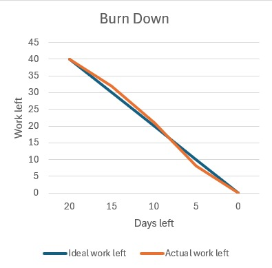

# iteration-2

* Assumed Velocity: 0.7  
* Number of developers: 4  
* Total estimated amount of work: 20 days  

---

## User stories or tasks:

### Todo

1. Gym Usage Tracking, priority High, 4 days  
   - Backend: return the equipment usage information to FE (HX, YJ), 2 days  
   - Frontend: a chart that shows all the equipment usage (TQRN), 2 days  

2. Virtual Gym Tour, priority Low, 4 days  
   - Display photos in the gym (TQRN), 1 day  
   - Introduce equipment in the gym, 2 days  
   - Show the gym location in a campus map, 1 day  

3. User Monitoring, priority Medium, 4 days  
   - Member data, such as reservation status / in / out record (MTN), 2 days  
   - In / out record (HX, YJ), 2 days  

---

## In progress:  

---

## Completed:  

* Gym Usage Tracking  
   - Backend: return the equipment usage information to FE (HX, YJ), 14 July 2025  
   - Frontend: a chart that shows all the equipment usage (TQRN), 15 July 2025  

* Virtual Gym Tour  
   - Display photos in the gym (TQRN), 25 July 2025  
   - Introduce equipment in the gym, 28 July 2025  
   - Show the gym location in a campus map, 29 July 2025  

* User Monitoring  
   - Member data, such as reservation status / in / out record (MTN), 1 August 2025  
   - In / out record (HX, YJ), 5 August 2025  
---

## Burn Down for iteration-2:
Update this at least once per week  
* 4 weeks left: 20 days of estimated work remaining  
* 2 weeks left: 12 days remaining  
* 1 week left: 5 days remaining  
* 0 weeks left: 0 days remaining  
* Actual Velocity: 20 / (20 × 4) = 0.25

